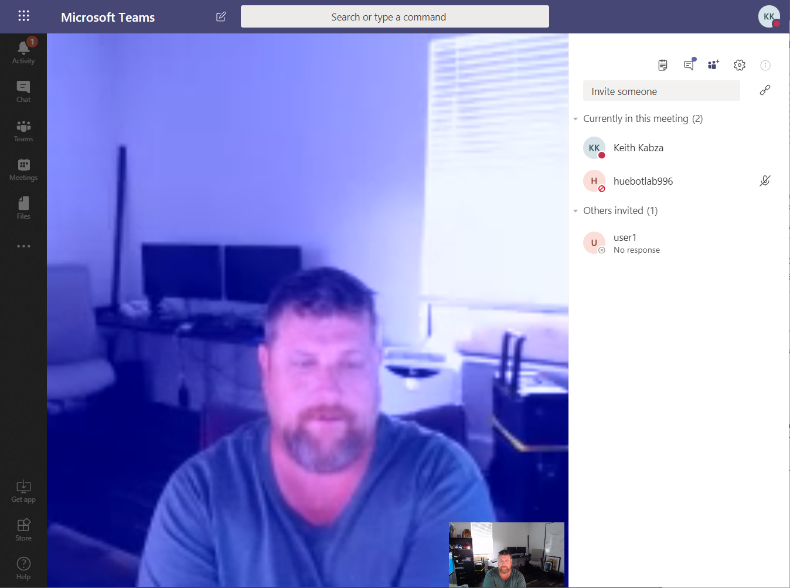

# Table of Contents

#### [Developing a Teams Media Bot](./)

Exercise 1: Setting up your development environment

[Exercise 2: Registering your Media Bot]()

[Exercise 3: Clone the Source Code in Visual Studio]()

[Exercise 4: Publish Bot application to Azure]()

[Exercise 5: Test HueBot Using Microsoft Teams]()

[Exercise 6: Configure Azure Unified Speech API]()

[Exercise 7: Modify Speech Recognition and Publish in Debug mode.]()

[Exercise 8: Add a new Color option and debug locally]()

[Conclusion]()


## Lab: Developing a Teams Media Bot

During this lab, you will learn how to build and deploy a Microsoft Teams media bot in Office 365 that will you allow your Bot to join a Teams meeting and gain access to the audio and video streams in the meeting. During the lab you will use the Microsoft Teams clients to join meetings and interact with the media bot.  The lab is divided into several exercises that will help you understand how to intelligent media bots that can perform advanced tasks using cognitive services. 

Estimated time to complete: _**40 minutes**_

### Before you begin

The type text feature **\[T\]** used in this lab will send the specific text string to the active window in the virtual machine. Always compare the text in the lab document with the typed text in the virtual machine and verify the expected text shown.

To complete the exercises in this lab, you will need a an O365 Tenant with an enterprise E5 Trial subscription and an Active Azure subscription. You can obtain one by registering for the Office Developer Program here [https://developer.microsoft.com/office/profile](https://developer.microsoft.com/office/profile)

Follow the prompts to create a new subscription and complete the required forms. 


Provide your phone number and complete the process by entering the 5 digit code you received via text message. Once complete your subscription will be created!


You should be able to logon to your subscription now. Now you need to assign some licenses and create a few test users. Using the Office 365 Admin center create at least two test users. Assign one of the provided E3 Licenses to each of your users. 


### Enable Azure Pass

Navigate to this url [https://www.microsoftazurepass.com/](https://www.microsoftazurepass.com/) to activate the Azure Pass for this lab instance.


Click the start button and sign on with the O365 administrator account you created in the previous step.


Click **Confirm Microsoft Account**


Now enter the Azure Pass you were provided for the lab and click **Claim Promo Code**


Click Next on the following screen


Agree to the subscription agreement and click signup.


Once your subscription is active you will be redirect to the Azure portal 


### Scenario

You are developing a bot application that can be used with your Microsoft Teams deployment. This lab scenario will get you familiar with deploying Bots for Teams and using the Graph Communications API for real-time media Bots that can join meetings, make calls and process inbound and outbound media streams.


## Exercise 1: Setting up your development environment

### Overview

This lab will require access to an Azure subscription. You can use an existing internal subscription or request an Azure pass for the lab. This bot will use the following Azure components

* Azure Bot Channels Registration
* Azure App Registration
* Azure Key Vault


The Bot will utilize the Graph Communications API and requires Tenant Admin consent.


Connect to your lab virtual machine here: [https://labondemand.com/LabProfile/x](https://labondemand.com/LabProfile/55694)xx sign on as **xxx** and use password **xxx.** 

### Deploy Cloud App

Logon to your Azure subscription and click create _**Create a Resource**_ search for "Cloud Service"  and click create.


Enter **huebotlabxxx** for the dns name


### Setup SSL Certificate

Download the teamsbots.com wildcard certificate to your virtual server : [https://1drv.ms/u/s!Al-Ih3130\_Cik7NijkBoAUmwWPuDJQ?e=Eynf86](https://1drv.ms/u/s!Al-Ih3130_Cik7NijkBoAUmwWPuDJQ?e=Eynf86)  

Navigate to the newly deployed cloud services in Azure portal and select certificates and click the Upload menu option

 


Browse for the certificate downloaded in the previous step and provide the certificate password: **summerready**


Refresh the certificate blade and you should see the imported wildcard certificate


Save the certificate thumbprint it will be needed in Exercise 3. The lab uses a wildcard certificate for the domain teamsbots.com   
The Thumbprint is: **1E872674EDE0781ECE8C209C2D9EEC5822D04B77**


### **Deploy a Classic Cloud Storage Account**

From Azure portal select Create Resource and select Storage Account


From the create storage account blade click the link called "**Choose classic deployment model**"


Now update the form with your resource group, use your huebotlabxxx value for the storage name and change the replication to Locally Redundant Storage. Then click Review + Create and click the Create button on the preceding page.


## Exercise 2: Registering your Media Bot

### Overview

In this exercise you will register your Bot in Azure active directory and assign the required Graph API permissions. You will also enable the Teams channel and calling features for your Bot. The final step will be to provide tenant admin consent for your Bot application .

### Register The Bot Application

Logon to Azure portal and click the _Create Resource_ menu option.


Search for Bot Channels Registration and click the _Create_  button


Enter the Bot name provided for your lab session **huebotlabxxx**. Select or create a resource group and leave the Messaging endpoint blank for now we will update this later in the lab. You will need to create a resource group for the lab we used one called HueBot.


Note is you receive this error set application insights to **OFF**


Click create to complete the registration. Once the Bot registration resource becomes available navigate to the bots settings and copy the Microsoft App ID it will be used in a future exercise.

### Configure the Microsoft Teams Channel

Now click on the Channels menu option to configure your bot to work with Microsoft Teams.


Now click on the Teams Icon


No click on the Teams calling tab. Check the box to enable calling and enter the webhook URL. Use your huebotlabxxx value ****for example**:**   **https://huebotlabxxx.teamsbots.com/api/call** click the save button when finished**.** You must agree to the Terms of Service when prompted.


### Collect the App Id and create a new Secret

Navigate to the new Bot registration and select the settings menu option from the left menu. Copy the Microsoft App Id and save this for later in Exercise 3.


Once you have saved your App Id click the Manage link to create a new client secret. Click on the Certificates & Secrets options from the left menu and click the **New client secret** button


Provide a description for your new secret and click the **Add** button


Copy and save the newly generated secret for later in Exercise 3.


Now Select API Permissions form the left menu and click on Add Permissions.


Click on the **Microsoft Graph** permissions button


Select Application permissions 


Expand the Calls permissions group and check the following: 

* **Calls.AccessMedia.All**
* **Calls.JoinGroupCall.All**


Back on the API Permissions page click on the Grant Admin Consent button. You must have global administrator permissions for the Azure subscription.


### 

## Exercise 3: Clone the source code in Visual Studio

The lab sample is hosted in Azure DevOps and you will need to use your @microsoft.com ID to access the code base. From your lab virtual machine open Visual Studio 2019. Click on the Team Explorer Tab and click on the green plug icon on the top menu. Click on **Clone**


Paste the following Repo URL into the text box: [https://vsogd.visualstudio.com/ServicesCode-Assets/\_git/BP-HueBotClouldServiceVersion](https://vsogd.visualstudio.com/ServicesCode-Assets/_git/BP-HueBotClouldServiceVersion) and click the Clone button.


If prompted for credentials use your Microsoft corp account.  
Now expand the Local Media Samples folder and double click on HueBot.sln


If you are prompted to download .NET Framework 4.6.2 select the download option and click OK. You may receive this prompt a second time select the download option. 


Scroll down to the .NET Framework section and download the Developer Pack for version 4.6.2


Select to Run the installation


Once the .NET 4.6.2 Framework is installed close Visual Studio and reopen the HueBot.sln   
Expand the WorkerRole project and open the app.config file. Scroll down until you see the appSettings section.


Update the values you saved from Exercise two. The BotID will be your Bot names used when you Registered the Bot Channel.


Now save your changes and expand the HueBot Cloud Service project in Solution Explorer. Open the file **ServiceConfiguration.Clouc.cscfg** file. Scroll down to the ConfigurationSetting section


Update the ServiceDnsName replace the xx with your hubotlabxxx value.  
Now update the ServiceName replace the xx with your huebotlabxx value  
Now update the DefaultCertificate replace the &lt;Paste Thumbprint&gt; with the certificate thumbprint you saved in Exercise 1.


Save your changes!

## Exercise 4: Publish Bot application to Azure

From your Lab virtual machine select the HueBot cloud service application and right click and select Publish.


Expand the account drop down list and select Add an account


Enter the administrator account for you Office 365 subscription along with the password.


Select your Azure Pass subscription and click Next


If you completed the previous Exercises the wizard values should pre-populate for you and look similar to this configuration. Review the Advanced settings tab and then click Next twice!


Now click the Publish button. It will take approximately 7 minutes to deploy your application to Azure.


If you did everything correct you should a result like the screen below. It will Complete the deployment. If you receive an error you screwed up somewhere flag down a proctor!


## Exercise 5: Test HueBot Using Microsoft Teams

### Get your Office 365 Tenant ID

Logon to Azure portal and click on Azure Active Directory from the left menu. Now click on properties from the blade menu and copy your Directory ID. We will use it later in this Exercise


### Schedule a Teams Meeting for testing

Now that you have successfully published your Bot application to the Azure cloud services it time to test your work. Logon to Microsoft Teams [https://teams.microsoft.com](https://teams.microsoft.com) with your Office 365 Developer subscription as administrator. Its easier to use the browser based client but you must use either Edge or Chrome browser to support audio and video.

Once you are logged in to Teams create a new meeting.


Enter a meeting title and invite at least one additional user to the meeting.


Now copy the meeting URL from the newly created meeting we are going to use it later in this exercise.


### Install Postman

We will use postman to submit an HTTP POST command to the Bot. Download and install postman from here: [https://app.getpostman.com/app/download/win64](https://app.getpostman.com/app/download/win64)


Once postman is installed you will need to create an account if you already have one just sign in.


There will be a default request when the application starts. Change this request from a GET to a POST


Enter the following URL in the request URL text box: [https://huebotlab999.teamsbots.com/joinCall ](https://huebotlab999.teamsbots.com/joinCall%20)


Click on the Headers tab and enter new header for **Content-Type** with the value as **application/json**


Now click on the Body tab, select RAW and paste the following JSON syntax into postman.

```text
{
        "TenantId": "YOUR TENANT ID",
        "JoinURL": "YOUR MEETING ID"
}
```


### Join Teams Meeting

Now return to Teams and join the meeting you created in the previous step. Once you are joined start your audio and video. You will need to join the meeting using a client that has access to audio and video. 


The lab virtual server will not have audio or video.



Now return to postman and submit the HTTP POST command. You will see huebot join your meeting and it should begin to stream back your video.


You should get a response with a GUID. This is the new callID generated by Teams. Return to your Teams meeting and you should see HueBot appear in the roster.





## Exercise 6: Configure Azure Unified Speech API

### Configure a new Speech Subscription

Logon to Azure portal and click on Create Resource and enter "Speech" 


Now enter the configuration below and click create. 


For the name user you **huebotlabxxx** assigned value.



Once the resource is created navigate to it.


Navigate to Keys from the left menu and copy Key 1. We will use it later in the Exercise


Now return to your Lab Virtual Machine. We need to update the sources for in the HueBot solution. Under the FrontEnd project open the CallHandler.cs file.


We need to update the code with our new Speech API Key on line 84


Paste your API Key 1 value from the previous step. If you used the US West data Center when you configured the Speech service you will need to enter uswest as the ServiceRegion. If you are not using US West use the correct value below

| Region | Speech SDK Parameter |
| :--- | :--- |
| West US | westus |
| West US 2 | westus2 |
| East US | eastus |
| East US 2 | eastus2 |


You will find a complete list of Service Regions here:  [https://docs.microsoft.com/en-us/azure/cognitive-services/speech-service/regions](https://docs.microsoft.com/en-us/azure/cognitive-services/speech-service/regions)


So your updated code should look something like this


Save your changes and select the HueBot cloud service project. Right click and select Publish.


When the publishing wizard appears just click on Publish. If you receive a deployment warning just click replace to overwrite the previous deployment. The update will take approximately 3 minutes. 


Once the deployment is complete return to you Teams meeting that you joined in a previous Exercise.


When you redeployed the Bot solution to Azure cloud service HueBot was dropped from the meeting. Return to postman and send the same HTTP POST command we sent the first time.


Now inside the Teams meeting make sure you Microphone is unmuted and you can speak **Red, Green or Blue** and HueBot will change the color of the video stream it is currently sending. 


## Exercise 7: Add a new Color option and debug locally

Presentation walk through!

## Conclusion

Now that you have deployed a real time media bot review the APIs to begin scoping and designing your own custom Teams based media Bots.

Additional resources:

[https](https://docs.microsoft.com/en-us/microsoftteams/platform/concepts/calls-and-meetings/real-time-media-concepts)[://docs.microsoft.com/en-us/microsoftteams/platform/concepts/calls-and-meetings/real-time-media-concepts](https://docs.microsoft.com/en-us/microsoftteams/platform/concepts/calls-and-meetings/real-time-media-concepts)

[https](https://microsoftgraph.github.io/microsoft-graph-comms-samples/docs/)[://microsoftgraph.github.io/microsoft-graph-comms-samples/](https://microsoftgraph.github.io/microsoft-graph-comms-samples/docs/)[docs/](https://microsoftgraph.github.io/microsoft-graph-comms-samples/docs/)

[https://github.com/microsoftgraph/microsoft-graph-comms-samples](https://github.com/microsoftgraph/microsoft-graph-comms-samples)

